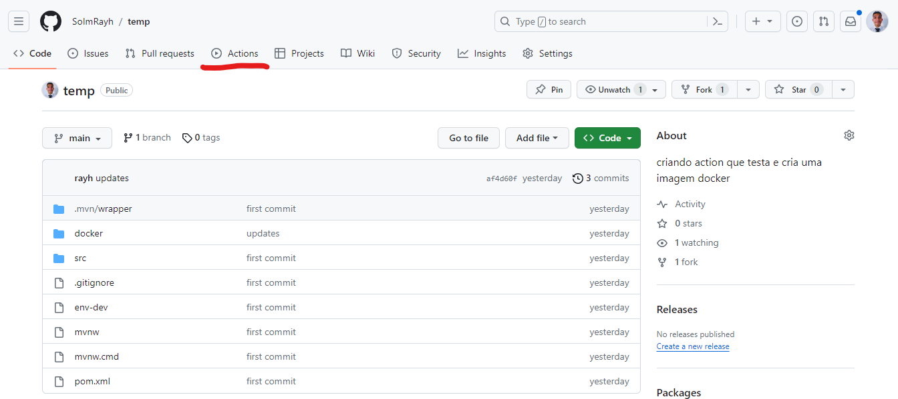

# Implementando CI-CD com gitHub actions e watchTower


# Objetivo
Implementar um pipeline que automatize o processo de criação de imagens docker de aplicações, push em um registry de
imagens docker, logo após essa imagem deve ser atualizada na máquina de produção de forma automática.

## Passos
 - [Aplicação base](#aplicação-base)
 - [Criando seu primeiro Workflow](#criando-seu-primeiro-workflow)
 - [Configurando para criar e publicar imagens docker](#configurando-para-criar-e-publicar-imagens-docker)
 - [Configurando a máquina de produção](#configurando-a-máquina-de-produção)
 - [Testando o pipeline](#testando-o-pipeline-de-cicd)

# Aplicação base

Para poupar tempo com coisas que não são o nosso foco desenvolvi uma API bem simples para não ocupar muito do nosso tempo.

## façam o fork do repositório [SoImRayh/temp](https://github.com/SoImRayh/temp)

Para iniciar com actiosn precisarei fazer commits direto no repositório.

## Sobre a aplicação

A aplicação é bem simples apenas um crud de um model Pessoa:

```java
public class Pessoa {
    
    private String nome;
    private String sobrenome;
    
}
```

E uma pagina html simples retornada quando dada um get no caminho "/";

```java
 @GetMapping("")
public ModelAndView home(){
 return new ModelAndView("index.html")
}
```

# Criando seu primeiro Workflow

Workflow é nada mais que um pipeline de serviços com diversos estágios, mas para iniciar vá até o repositório no github e na aba actions.



E logo após selecione o que melhor se encaixa, nao se preocupe você pode pesquisar por actions no [marketplace de actions](https://github.com/marketplace?type=actions).

# Configurando para criar e publicar imagens docker

Utilizando o serviço de publicar usaremos usando secrets para acessar as variáveis de actions para guardar nossas informações do dockerhub.

Para criar essas variáveis siga os passos:
- Página inicial do repositório
- Configurações
- Secrets e variables
- Actions
- Repository Secrets
- Adicione a variáveis com os dados da sua conta dockerHub
    - DOCKER_USERNAME
    - DOCKER_PASSWORD

# Configurando a máquina de produção

Na máquina adicionaremos um novo serviço ao docker compose que ficara vendo se as imagens docker tem atualizações, se tiver substitui a imagem.

```yml
watchtower:
  container_name: watchtower
  image: containrrr/watchtower
  command: cont1 cont1 cont3 + commands #container's name to track and additional params
  environment:
    - WATCHTOWER_CLEANUP=true # remove old image after update
    - WATCHTOWER_POLL_INTERVAL=300
  volumes:
    - /var/run/docker.sock:/var/run/docker.sock
```

# Testando o pipeline de CICD

Vamos aplicar isso localmente na nossa máquina para testar:

```yml
version: '3'

services:
    nginx:
        container_name: nginx
        image: nginx
        volumes:
            - ./nginx:/etc/nginx/conf.d/
    app:
        image: imrayh/temp
        container_name: api
        env_file:
            - ../env-dev
        volumes:
            - ../:/usr/src/mymaven
    db:
        container_name: postgres
        image: postgres
        env_file:
            - ../env-dev
    watchtower:
        container_name: watchtower
        image: containrrr/watchtower
        command: cont1 cont1 cont3 + commands #container's name to track and additional params
        environment:
            - WATCHTOWER_CLEANUP=true # remove old image after update
            - WATCHTOWER_POLL_INTERVAL=300
        volumes:
            - /var/run/docker.sock:/var/run/docker.sock
```

NGINX CONF

```nginx
    server {
        listen 80;

        location / {
            proxy_pass http://api:8080;
        }
    }
```

.ENV
```
POSTGRES_USER=test
POSTGRES_DB=postgres
POSTGRES_PASSWORD=test
PGDATA='/var/lib/postgresql/data/pgdata'

POSTGRES_URL=jdbc:postgresql://postgres:5432/postgres
```

# Referências
 - [GitHub actions](https://docs.github.com/pt/actions)
 - [Watchtower](https://containrrr.dev/watchtower/)
