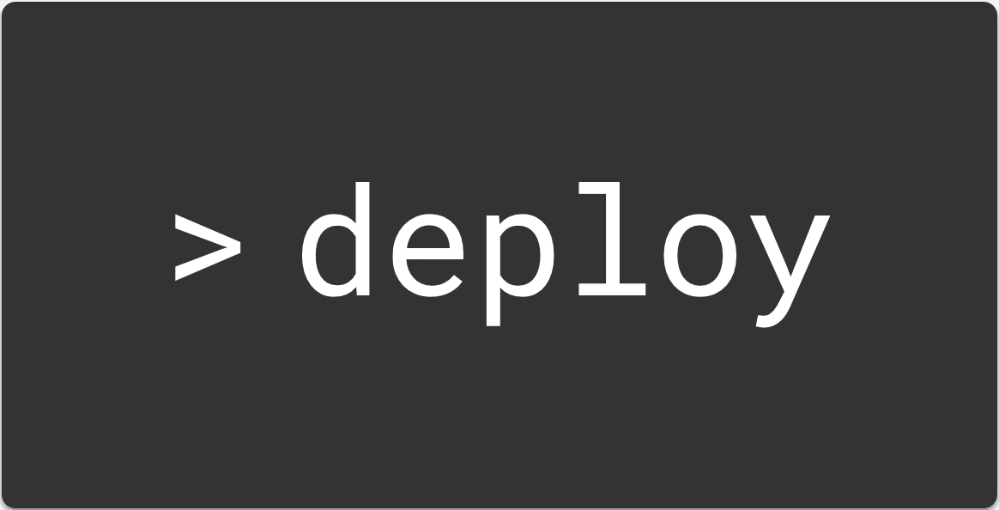
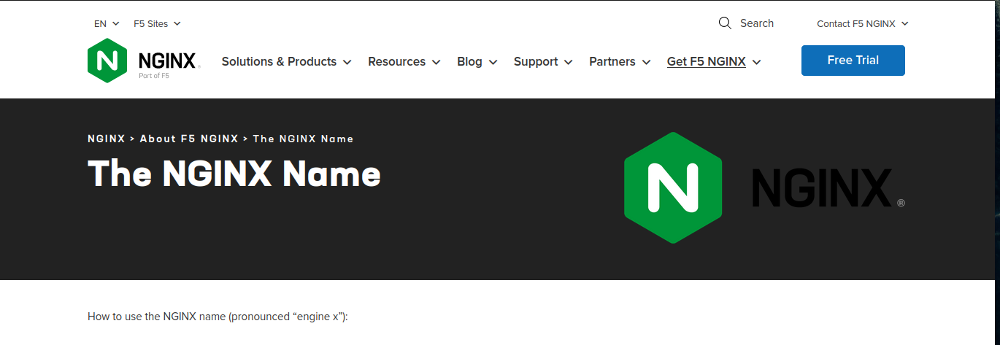
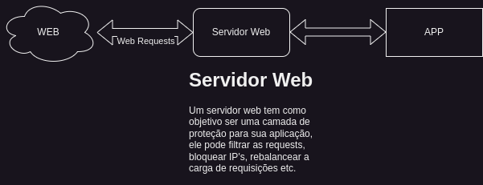
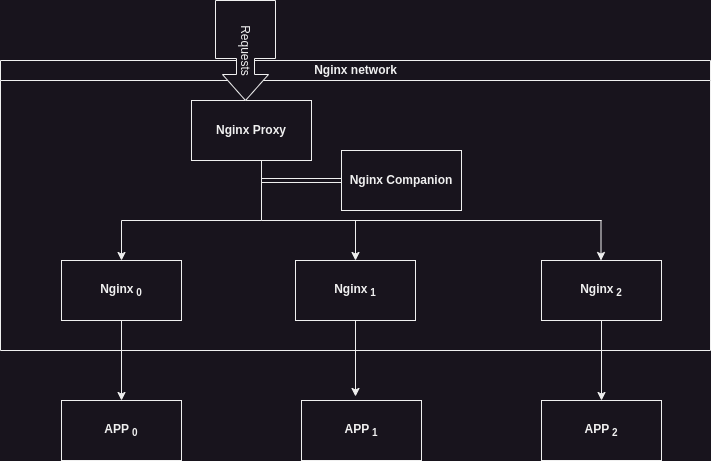

# Objetivo

Colocar uma aplicação em produção na web, configurando DNS, Nginx, Docker.

# Nginx

# Importantíssíssíssíssímo

De acordo com o site official a pronúncia correta é **engine x** e não **eni jinx**. Agora dada a devida atenção, vamos prosseguir.



## O que é o nginx

Nginx a pricipio é um projeto open source de um servidor web de alto desempenho e escalabilidade, atualmente ele entá dentre os mais famosos, contudo não é o único, temos outros famosos como:

- [Apache tomCat](https://tomcat.apache.org/)
- [Apache WebServer](https://httpd.apache.org/)
- [CentOS stream](https://www.centos.org/centos-stream/)

Isso fora servidores web criados apenas para fim de desenvolvimento, um exemplo sao as aplicações NodeJs, sempre que você executa um comando `
npm run dev` se inicia um servidor para voce ter acesso ao desenvolvimento da aplicação.



## Uma configuração genérica para Deploy

Irei apresentar uma configuração simples que irá te ajudar em qualquer processo de deploy, ela se baseia em altomatizar diversas partes do processo que é colocar uma aplicação no ar.

Usaremos um conjunto de imagens docker em uma organização que nos permitirá subir aplicações futuras sem dor de cabeça com configurações de certificados SSL idependentemente do domínio a ser usado.

Explicarei melhor apresentando a imagem Abaixo.

### Organização de uma rede Docker



Nesta imagem é ilustrado como será a organização dos containeres Nginx.

## Observações

- **Todas** as requisições recebidas nas portas 80 e 443 serão entregues ao *Nginx Proxy* ele será o container gerenciador dos demais, ele que irá fornecer o roteamento de qual pacote irá para qual container de acordo com o domínio especificado.

- *Nginx Companion* é um serviço que irá procurar e descobrir novos containeres na rede que contenha novos domínios e junto com isso, irá gerar um novo certificado SSL fornecido pela empresa let's Encrypt (fornece certificados gratuitos, contudo reconhecidos na web), tornando a navegação https possível e segura.

- *Nginx* é um container padrão do servidor web Nginx, aqui que podemos fazer configurações necessárias para segurança da nossa aplicação.

## Implementação

**Passo 1** - O primeiro passo é criar a rede docker que vai englobar todos os containeres


```sh
    sudo docker network create nginx
```

**Passo 2** - Vamos criar um docker compose idepedente apenas para o Nginx proxy e o Nginx companion podemos usar o próximo codigo para facilitar, escrito ja podemos executar, a partir de agora todo container nginx que subirmos na rede *nginx* será verificado por esses dois containeres.

```yml
    version: '3.7'

services:

  nginx-proxy:
    image: nginxproxy/nginx-proxy
    container_name: nginx-proxy
    restart: unless-stopped
    ports:
      - "443:443/tcp"
      - "80:80/tcp"
    volumes:
      - /var/run/docker.sock:/tmp/docker.sock:ro
      - html:/usr/share/nginx/html
      - vhost:/etc/nginx/vhost.d
      - certs:/etc/nginx/certs
    networks:
      - nginx


  nginx-proxy-acme:
    image: nginxproxy/acme-companion
    restart: unless-stopped
    container_name: nginx-proxy-letsencrypt
    environment:
      - DEFAULT_EMAIL= ${Seu email aqui}
    volumes:
      - /var/run/docker.sock:/var/run/docker.sock:ro
      - acme:/etc/acme.sh
    volumes_from:
      - nginx-proxy
    networks:
      - nginx

volumes:
  vhost:
  certs:
  acme:
  html:


networks:
  nginx:
    external: true
```

**Passo 3** - Subir um container nginx para teste. Neste passo criaremos outro docker compose que simulara a idepedencia dos containeres, assim podemos subir esse container para gerenciar um app react e em outro compose podemos subir mais um container para gerenciar uma api, ou melhor podemos pedir ao mesmo container que gerencie os 2 app's ambos com dominios diferentes.

```yml
version: '3'
services:
  nginx:
    container_name: nginx
    image: nginx
    volumes:
      - ./nginx:/etc/nginx/conf.d/
    environment:
    # Quais dominions esse container gerencia
      - VIRTUAL_HOST=rayh.dev, code.rayh.dev
    # Todo nginx necessita de uma porta, aqui colocamos uma porta virtual para que possa ser encaminhada as requisições
      - VIRTUAL_PORT=8091
     # Domínios nos quais serão gerados certificados
      - LETSENCRYPT_HOST=rayh.dev, code.rayh.dev
    networks:
    # Rede que o container vai subir
      - nginx
networks:
  nginx:
    external: true
```

Pronto, agora temos tudo devidamente configurado, basta apenas configurar a instância (container) nginx tal como configuramos normalmente, vamos usar um configuração padrão apenas para fornecer um hello world.

```nginx
server {
    listen 8091;
    server_name code.rayh.dev;

    return 200 'code.rayh.dev';
}
server {
        listen 8091;
        server_name rayh.dev;
        return 200 'rayh.dev';
}
```

Agora sim as coisas funcionam, para apenas agir como se fosse sua aplicação substitua a linha `return 200 'rayh.dev'` para o bloco:

```nginx
    location / {
        proxy_pass {app.container.name}:{app.container.port};
    }
    # Exemplo
    location / {
        proxy_pass minha-api:8080;
    }
```

# Mão na massa!

Vamos usar o code spaces para brincar um pouco com nginx e implementar uma feature bacana do github.